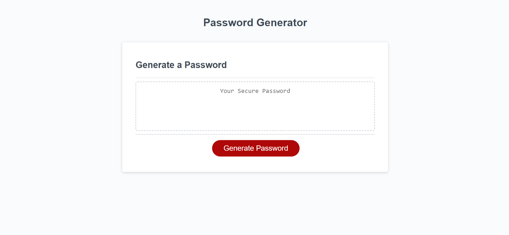

# Module 5 Assignment

# Building a Password Generator Using Advanced JavaScript

## Description:

I built this project to create a random password generator with the options to include numbers, special characters and lower or upper case characters, using the skills I have learnt in JS. Using prompts and alerts, the user is guided to creating his/her desired format for a password, free of any hassle to manually think of one themselves.

## Deployed Link:

https://adammbnitro.github.io/Password-Generator/

## License 

Copyright (c). All rights reserved.

Licensed under the MIT license.
